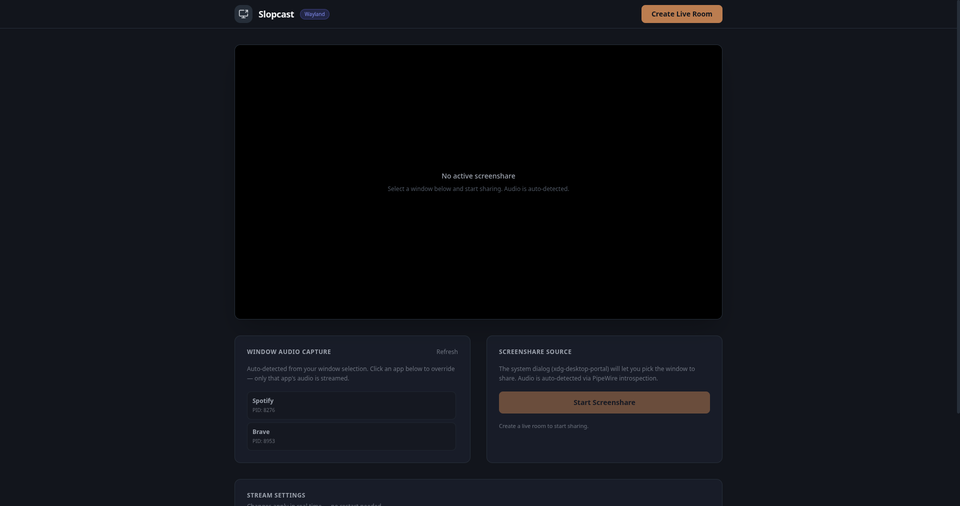

# Slopcast

<p align="center">
  
</p>

Room-based screen and audio sharing — present from the desktop app, spectate from any browser<sup><a href="#fn1" id="ref1">1</a></sup>.

<p align="center">
  
</p>

## How it works

1. **Present** — Launch the desktop app, create a room, and share your screen with per-application audio capture.
2. **Spectate** — Share the room link. Anyone opens it in a browser and watches the stream instantly — no install, no account.

The desktop app captures exactly one target application's audio via native OS APIs (PipeWire on Linux). No other app's sound ever leaks into the stream.

## Quick start

```bash
pnpm install
pnpm build:desktop

# Terminal 1 — signaling server
pnpm dev:server

# Terminal 2 — web spectator
pnpm dev:web

# Terminal 3 — desktop presenter
pnpm dev:desktop
```

Click **Create Live Room** in the desktop app, copy the room link, and open it in a browser.

## Project structure

```
apps/
├── desktop/     Electron + React + Rust (presenter & spectator)
├── web/         React browser app (spectator-only)
└── server/      Express + WebSocket signaling server
packages/
├── native-rust/ napi-rs native engine (PipeWire audio capture)
└── shared-types/ Shared TypeScript interfaces
```

For full architecture details see [AGENTS.md](AGENTS.md).

---

<sup id="fn1">1</sup> Currently tested on Chromium-based browsers (Chrome, Edge, Brave, Opera). Firefox and Safari support is planned. [↩](#ref1)
